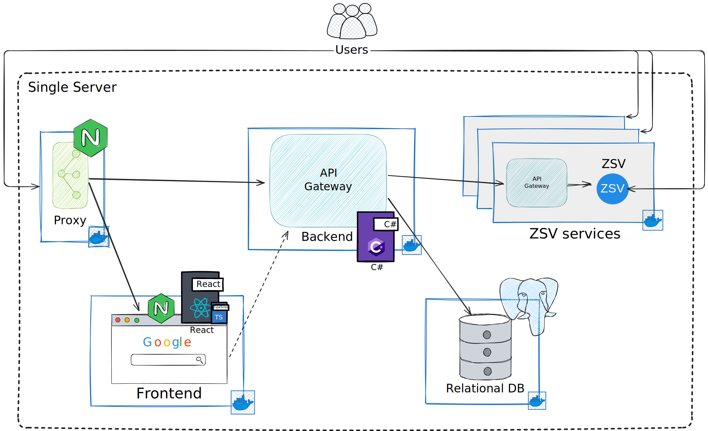

[![readme-ru-shield]][readme-ru-url]
[![readme-en-shield]][readme-en-url]

[readme-ru-shield]: https://img.shields.io/badge/ru-gray
[readme-ru-url]: README.md
[readme-en-shield]: https://img.shields.io/badge/en-blue
[readme-en-url]: README.en_EN.md


<div align="center">


# EasyZsV

[](https://github.com/F1st3K/EasyZsV/actions/workflows/test-single-deploy.yml) 

[](https://hub.docker.com/u/easyzsv)
[](https://creativecommons.org/licenses/by-nc/4.0/)
[](https://GitHub.com/F1st3K/EasyZsV/graphs/contributors/) 
[](https://github.com/F1st3K/EasyZsV/stargazers) 

EasyZsV - Easy Zooming secure Velocity!

[
    <h3>
    
    💻 Watch
    </h3>
](https://www.youtube.com/watch?v=nR8FZ8_98pk)

---

</div>

## Single Deploy (docker-compose)
To deploy `EasyZsV` on a single server, use `Docker Compose`:

### Production enviroment:

```bash
curl -L -o docker-compose.yml https://raw.githubusercontent.com/F1st3K/EasyZsV/refs/heads/main/docker-compose.yml && \
curl -L -o .env https://raw.githubusercontent.com/F1st3K/EasyZsV/refs/heads/main/.env.dev
```

> It is recommended to change variables in `.env`

```bash
docker-compose --profile init up
```

> `--profile init` - used at the first run to initialize data, then just run:
```bash
docker-compose up
```

### Develop environment:

```bash
git clone https://github.com/F1st3K/EasyZsV
```

```bash
docker-compose --env-file .env.dev --profile init up --build
```

> `--profile init` - used at the first launch to initialize data, then just build and launch:
```bash
docker-compose --env-file .env.dev up --build
```

Also for independent deployment of the components of the `EasyZsV` web application, you can use the documentation for each service:
[EasyZsV backend](backend/README.md), [EasyZsV frontend](/frontend/README.md), [EasyZsV init](/init/README.md), as well as others [EasyZsV services](/services/README.md).