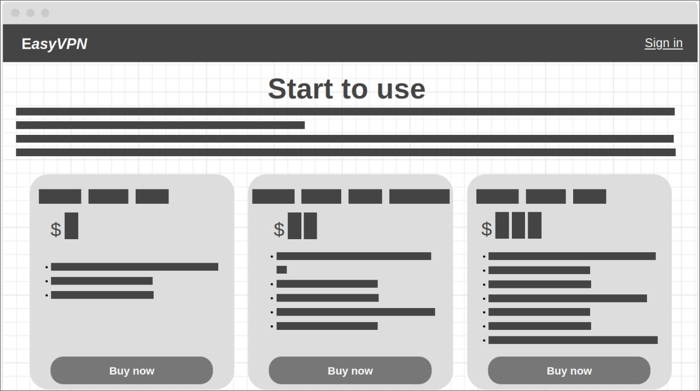
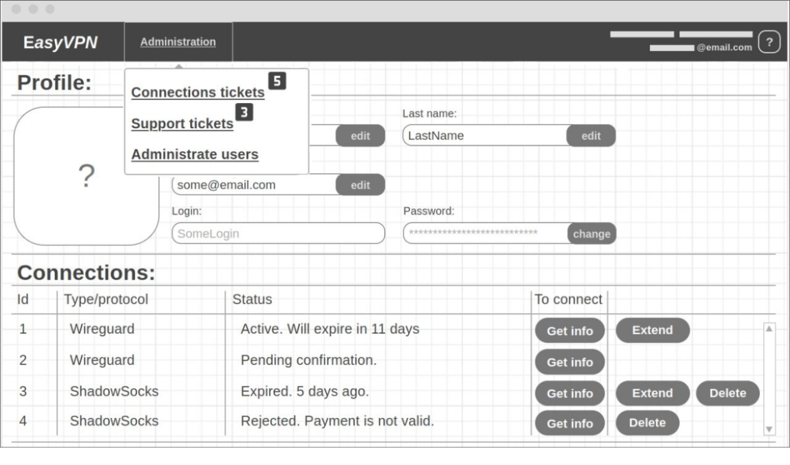
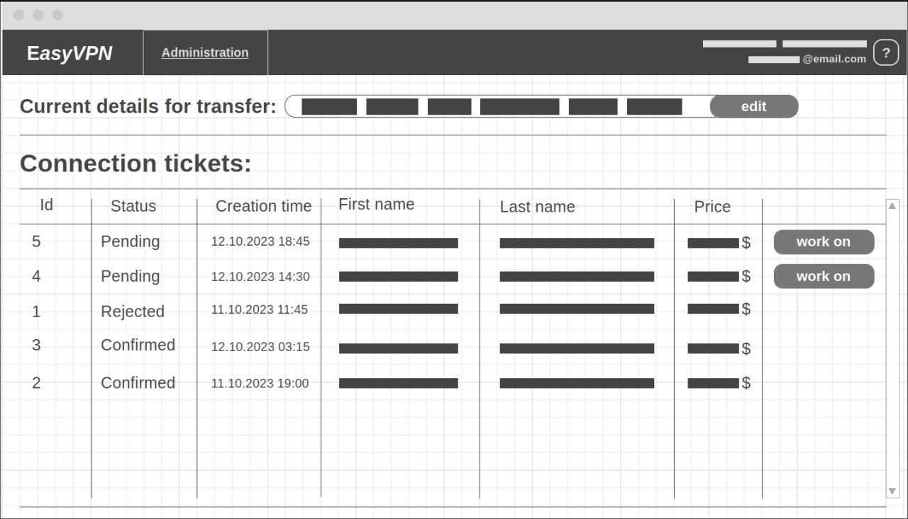
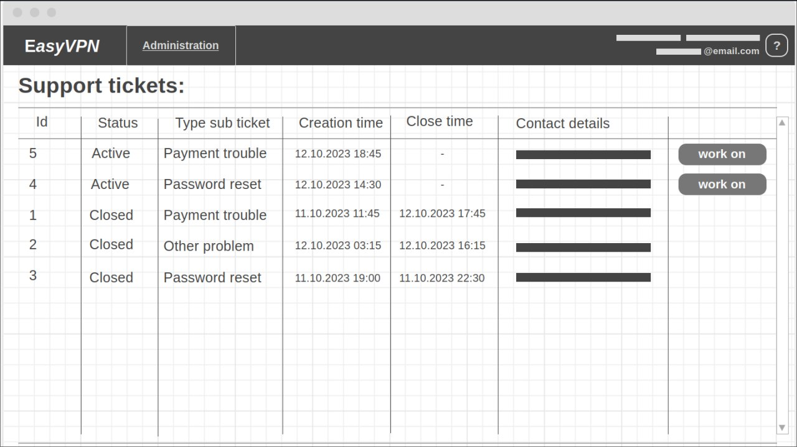

[](README-EN.md)
[](README.md)

# EasyVPN
Простое VPN + Backend + Frontend приложения на одном сервере!


<details>
	<summary><h2>EasyVPN API</h2></summary>

### Ошибки

#### Конечная точка ошибок
```http
{{host}}/error
```

#### Ответ ошибки
```http
400 Bad Request
``` 
```http
{
  "type": "https://tools.ietf.org/html/rfc7231#section-6.5.1",
  "title": "Invalid login or password",
  "status": 400,
  "traceId": "00-ddbb5dae1dcf8a772b1e236a7259f07e-e58fef179b5dd0fb-00",
  "errorCodes": [
    "Authentication.InvalidCredentials"
  ]
}
```

### Авторизация

##### Запрос регистрации
```http
POST {{host}}/auth/register
Content-Type: application/json
{
    "firstName": "Freak",
    "lastName": "Fister",
    "login": "F1st3K",
    "password": "fisty123"
}
```

##### Запрос входа
```http
POST {{host}}/auth/login
Content-Type: application/json

{
    "login": "F1st3K",
    "password": "fisty123"
}
```

##### Ответ авторизации
```http
200 OK
```
```http
{
    "id":"88755e3c-e106-4283-bf93-17965b1a"
    "firstName": "Freak",
    "lastName": "Fister",
    "login": "F1st3K",
    "token":"56be52...e3c7743d"
}
```

</details>

---


<details>
	<summary><h2>Логика приложения</h2></summary>

### Для всех


### Для авторизованых


### Для клиентов


### Для проверяющего оплату


### Для администраторов


</details>

---
<details>
	<summary><h2>Прототип будущего сайта</h2></summary>


### Главная страница


### Страница авторизации


### Страница регистрации


### Профиль обычного пользователя


### Профиль администратора


### Страница заявок на подключение


### Страница заявок потдержки


### Страница администрирования пользователей


</details>

-----------------------------------------------------